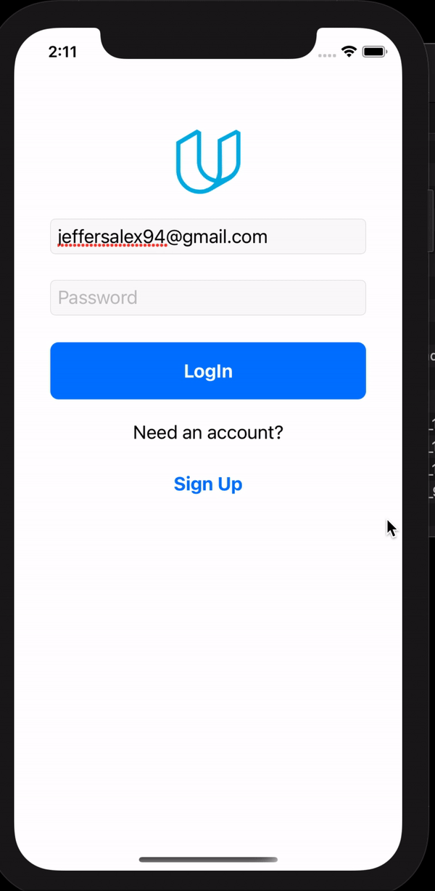

# OnTheMap
iOS Developer Nanodegree from Udacity. Showing how to do networkrequests,  GET, POST, DELETE and Authentication of users.

To login
* Have Udacity credentials.
* Or Facebook account that you have used with your Udacity account. 

Tapping on a link will take the user to Safari.
User can update their location, and provide a link to share with other students on the mapview.

